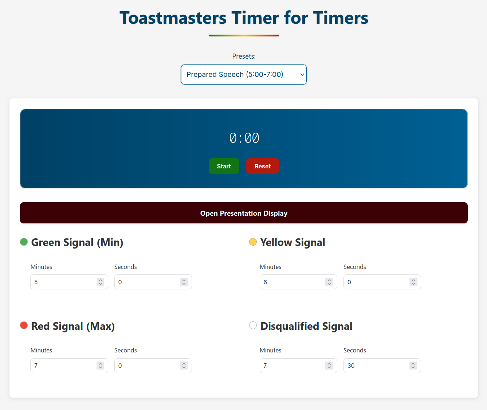

# Toastmasters Timer
A Toastmasters Timer made for Timers

[](https://www.apache.org/licenses/LICENSE-2.0)
[](https://astro.build)
[](https://alpinejs.dev)
[](https://bun.sh)

A timing tool for Toastmasters meetings with dual-screen functionality that's perfect for both physical and virtual meetings.

Visit [tmtimer.mikenitres.com](https://tmtimer.mikenitres.com) to see how it works!

_I recommended using a desktop or laptop for ease of use._



## Features

- **Dual-screen workflow**:
  - **Main Page**: Set custom timing thresholds
  - **Present View**: Clean, full-screen color display
- **Customizable signals**:
  - 🟢 Green (Minimum Time)
  - 🟡 Yellow
  - 🔴 Red (Maximum Time)
  - ⚪ White (Disqualified)

## Usage

1. **Setup**:
   - Open the main page
   - Configure your timing signals with the preset selector (or configure them manually)
   - Click "Open Present View" (opens in either a new window or tab depending on your browser settings - if as a tab, move it to separate window)

2. **During Meeting**:
   - Share the Present View window `/present` (fullscreen for best effect)
   - Manage timing from main page
   - Colors auto-update in real-time

## Development

Built with modern web technologies:

- [Astro](https://astro.build) - Static site generator
- [Alpine.js](https://alpinejs.dev) - Reactive interactivity
- [Bun](https://bun.sh) - Fast JavaScript runtime

### Local Setup

```sh
bun install          # Install dependencies
bun run dev          # Start development server
bun run build        # Production build
```

## Contributing

If there's anything you think that will be useful, feel free to create an issue or a PR.

## License

Copyright © 2025 Mike Nitres.

[Apache License 2.0](https://www.apache.org/licenses/LICENSE-2.0)